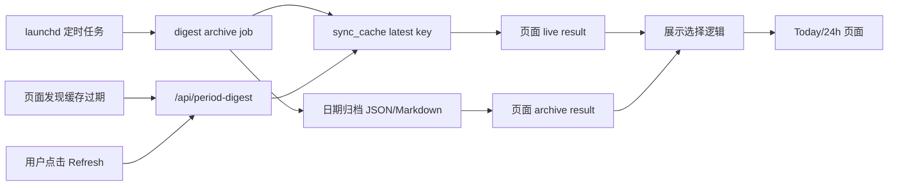

# Today/24h 摘要当前问题与根因

## 文档状态

- 类型：问题定义与设计输入，不包含实现方案
- 日期：2026-08-05
- 审计基线：`codex/issue-47-digest-recovery@26298e8`
- 范围：Today/24h 的定时生成、超时生成、手工生成、页面展示与存档；同时覆盖 Yesterday 的早间可用性
- 证据来源：当前 PR 代码、现有测试、2026-08-05 本机运行记录与页面缓存记录

> 2026-08-06 后续设计已确认：Today/24h 改为只保留持久化 latest-success，不再归档、无 Save，并移除 Today/24h 的 DM 开关。因此本文记录的原始诉求 7/8 和归档状态机分析仅作为问题演进背景；实施以 `2026-08-06-today-24h-digest-orchestration-design.md` 为准。

## 结论摘要

当前实现无法稳定满足目标体验。问题不是单个 launchd 配置或单个缓存 key，而是生成任务、结果版本、当前展示内容和归档文件之间没有统一的领域模型。

当前完整满足的核心诉求只有“有结果时显示生成时间”。后台任务跨页面继续执行、默认定时存档和手工替换存档已经具备部分能力，但都存在关键断点。其余诉求仍不满足。

这次反复出现问题的直接原因是：历次修改分别修复了锁存活、定时进度、凭据、时间戳、Save UI 和部分缓存参数，却仍沿用旧方案中的两个前提：

1. 缓存过期或新任务运行时，可以暂时不显示旧摘要。
2. 定时、超时和手工生成可以由不同入口分别管理，只需互斥或拒绝冲突。

这两个前提与本次确认的产品诉求相反，因此继续做局部补丁无法闭环。

## 目标体验基线

以下 10 条作为后续设计的验收基线：

1. 每天早上 9 点前应有可阅读的 Today、24h、Yesterday 摘要。
2. Today/24h 有定时、超时、手工三种生成触发方式。
3. Today/24h 显示当前内容的生成时间。
4. 超时时长可在 Config 配置；过期后由后台异步触发，不依赖页面访问。
5. 同一摘要的多个触发碰撞时合并为同一个生成任务，不拒绝、不排队重复生成。
6. 生成任务独立于页面生命周期，切换 period/source 后继续运行。
7. 每天默认归档计划内定时任务产生的 Today/24h 结果。
8. 手工或超时生成成功后，可以选择用该结果替换对应的当日归档；生成中不可保存。
9. 已经存在成功摘要时，任何新任务的运行或失败都不得清空页面内容。
10. 页面始终显示当前逻辑摘要身份下最新的已成功生成版本；新版本成功发布后再原子替换旧版本。

## 当前数据流

当前缺失的是一个同时拥有触发合并、任务状态、结果发布和最新成功版本指针的服务端边界。页面目前必须在 live cache、活动归档和组件内 state 之间自行推断应该展示什么。

## 问题清单

### P0-1 当前展示内容与生成状态耦合

`useDigestStream` 在每次请求开始时清空 `markdown`、`context` 和 `result`。手工刷新和页面触发的过期刷新都会立即移除旧内容；请求失败后旧内容也不会恢复。

页面首次发现同一摘要正在后台生成时，只进入 watching 状态，不采用 metadata 同时返回的已有成功结果。定时运行时，页面又强制优先活动归档；如果当前 source 尚未发布归档，就显示 `This source is still being generated.`。

因此以下场景当前必然或可能显示空内容：

- 手工生成进行中；
- 超时生成进行中；
- 打开页面时另一个 Web 生成任务正在运行；
- 定时任务正在生成当前 source，但当天文件尚未发布；
- 缓存过期、跨日或生成配置变化后，当前精确 key 不再命中；
- 新任务失败，且请求开始时已经清空旧结果。

影响：诉求 9，以及 10b、10d、10e、10g、10h、10i。

### P0-2 没有统一的跨进程 single-flight 编排器

当前有两套互不共享的并发控制：

- 定时任务使用按 period 粒度的文件锁；
- Web 生成使用服务进程内的 `Map<generationKey, status>`。

Web API 写入 registry 前不检查已有任务，也不保存可复用的 Promise 或结果句柄。两个页面请求可以同时生成。定时任务运行时，Web API 选择返回错误；Web 任务先启动时，独立的定时进程看不到 registry，仍可启动第二次生成。

这不是“合并”：

- 定时先开始：Web 请求被拒绝；
- Web 先开始：定时任务可重复生成；
- 两个 Web 请求同时开始：可重复生成；
- 同 period 不同 source：period 级锁会过度阻塞无关 source。

影响：诉求 5，并间接影响 1、6、8、9、10。

### P0-3 缺少逻辑摘要身份下的“最新成功版本”

当前系统存在三类结果载体：

1. 按内容上下文和生成配置保存的内部摘要缓存；
2. 按日期、source、执行参数和生成配置计算的 `latestDigestCacheKey`；
3. 按 `date/period/source` 保存的归档 JSON 和 Markdown。

`latestDigestCacheKey` 包含 `maxTweets`、`maxLinks`、模型、语言、reasoning effort、service tier 和 prompt hash。这些字段适合作为不可变结果版本的一部分，但不适合作为页面查找“上一成功结果”的唯一入口。

当前没有独立于生成配置的 latest-success 指针或查询。修改模型、语言、提示词，或跨过 Today 的自然日边界后，旧结果仍可能存在于存储中，但页面无法把它作为生成期间的回退内容。

影响：诉求 1、9、10a 至 10i。

### P0-4 Save API 与页面生成使用不同缓存身份

页面手工生成固定使用 `maxTweets=5000`、`maxLinks=20`。Save API 在读取待保存结果时只传入 period、contentSource 和 includeDms，因此按默认 `2500/12` 计算 latest key。

结果是 Save 按钮和 `/api/digest-archive-save` 路由虽然已经存在，但服务端可能找不到刚刚由页面生成的结果并返回 404。当前 Save API 测试 mock 了 `readLatestPeriodDigestEffect`，没有验证从真实页面参数写入再由 Save API 读取的端到端身份一致性。

影响：诉求 8。

### P1-1 超时不是后台触发器，Config 也不可配置

底层支持 `digest.freshnessSeconds` 和环境变量，代码默认值为 5 分钟；本机 `config.json` 当前实际配置为 43200 秒，即 12 小时。

Config 页面和 `/api/digest-schedule` 都不读写该字段。系统也没有后台 freshness scheduler。过期只在页面请求 metadata 或生成 API 时被检查。

页面处于打开但空闲状态时，metadata 不持续轮询；`startedRef` 还可能阻止同一挂载实例在稍后过期时重新触发。因此当前甚至不能保证“访问页面一定触发过期更新”。

影响：诉求 2、4、9、10g。

### P1-2 语言身份仍有潜在分叉

Web 生成的语言只取请求参数或 `BIRDCLAW_DIGEST_LANGUAGE`；定时任务还会回退 Config 的 `language.aiLanguage`。

当前机器的环境变量和 Config 都是 `zh-CN`，所以这不是 2026-08-05 早间问题的直接原因。但环境变量缺失，或 Config 语言与环境变量不一致时，定时和 Web 会再次产生不同 latest key。Config 中的语言变更也不能保证即时改变 Web 摘要身份。

影响：诉求 1、10c、10f 的潜在回归。

### P1-3 页面切换存在旧流覆盖新视图的竞态

服务端故意不把浏览器断开信号传给摘要生成，这保证任务能在切页后继续。这个方向符合诉求 6。

但客户端的 NDJSON 请求只在启动另一请求或组件卸载时中止。Today/24h/source 切换通常复用同一组件，身份变化不会主动解绑旧流；旧流的事件处理器也不校验结果属于哪个 period/source。旧任务稍后完成时，可能把旧结果写入当前页面 state。

影响：诉求 6、10，并可能解释部分跨 tab 时间戳或内容不一致现象。

### P1-4 存档生命周期没有完整状态机

当前已具备：

- 定时任务为 Today/24h 的三个 source 分别落盘；
- 手工 Save 只替换当前 period/source；
- 保存期间有 publication lock；
- 定时生成或保存进行中时按钮禁用。

当前仍缺少：

- “当天计划内定时任务只建立一次默认存档”的约束；
- 用户替换后的归档不被同日后续定时重跑覆盖的规则；
- 超时生成完成后的 Save 资格；
- 可跨页面重载恢复的 Save 资格或结果 provenance；
- DMs 开关与仅有六个归档文件之间的明确语义。

定时任务当前每次运行都会无条件写同一路径。Config 保存会重新加载 LaunchAgent，而 plist 设置了 `RunAtLoad=true`，可能形成计划之外的同日重跑并覆盖用户手工替换版本。

影响：诉求 7、8。

### P1-5 调度可靠性缺少用户可见闭环

Config 页面只显示计划时间和归档目录，没有展示：

- LaunchAgent 是否安装成功；
- 下次计划运行时间；
- 上次运行时间和结果；
- 各 source 是否成功或 degraded；
- 当前是否正在补跑。

`/api/digest-schedule` 会先写配置，再逐个安装四个 agent。单个安装失败被包装在 `installResults` 中，顶层响应仍返回 `ok:true`；Config 响应 schema 不读取 `installResults`，仍显示“调度已保存并生效”。

影响：诉求 1 的可验证性和故障恢复体验。

### P2-1 定时降级信息没有呈现在有内容的页面

归档 JSON 已保存 `batchStatus` 和 sync 信息，status API 也返回最近运行的 `ok/degraded/failed`。Today 页面只在当前没有结果时显示失败；存在可读摘要时，不展示该摘要来自 fresh 还是 degraded 数据同步。

这不会导致摘要为空，但会让用户把数据不完整误判为生成正常。

### P2-2 定时摘要是计划时刻的快照

Today 在 08:00 生成时覆盖当天 00:00 至 08:00；24h 在 08:30 生成时覆盖此前滚动 24 小时。用户在 09:00 阅读时，Today 不包含 08:00 至 09:00 的新内容。

这是窗口语义，不是任务未运行。后续设计需要明确“9 点看到现成摘要”是要求任务在 9 点前完成，还是要求内容窗口覆盖到接近 9 点。

## 已确认已修能力

以下能力已存在于当前 PR，不应在新设计中重复当作缺失功能：

- 定时任务和页面的 `maxTweets/maxLinks` 已统一为 `5000/20`；
- Today/24h 已被归档 dates/entry API 接受；
- Today/24h 在检测到定时任务时会读取活动归档，并可逐 source 展示已完成文件；
- Today、24h、Yesterday、Week 均显示生成时间；
- 六个 Today/24h source 页面均有 Save 按钮和服务端替换 API；
- 定时锁已具备 owner ID、PID 存活判断、heartbeat、所有权安全释放和绝对最长时间；
- 服务端 Web 摘要任务与页面请求断开解耦，切页后可继续写入缓存。

这些能力可以复用，但不足以构成完整的生成与展示状态机。

## 10 条诉求当前判定

| # | 当前判定 | 主要原因 |
|---|---|---|
| 1 | 不满足 | 定时基础设施存在，但结果选择、休眠补跑和状态可见性无法保证 9 点可直接阅读 |
| 2 | 部分满足 | 定时和手工存在；超时只是页面驱动；RunAtLoad 还是额外触发 |
| 3 | 满足 | 有结果时屏幕显示 `updatedAt/generatedAt` |
| 4 | 不满足 | Config/API 无 freshness 字段；无后台过期调度 |
| 5 | 不满足 | 冲突时拒绝或并发，没有跨进程 single-flight |
| 6 | 部分满足 | 服务端任务继续，但客户端存在旧流跨身份写入竞态 |
| 7 | 部分满足 | 会定时落盘，但没有每日默认版本和用户替换保护 |
| 8 | 部分满足 | UI/API 已有；超时结果无资格，Save API 还有缓存 key 断链 |
| 9 | 不满足 | 手工、超时、活动定时 source、失败和跨配置均可能显示空内容 |
| 10 | 不满足 | 有局部时间比较，但没有统一的 latest-success 选择策略 |

## 根因归类

### 根因 A：结果身份与展示身份混用

系统只有“精确生成配置对应的 latest key”，没有“逻辑摘要身份对应的最新成功版本”。生成参数变化和内容可见性被错误绑定。

设计时应区分：

- 逻辑摘要身份：period、contentSource、account、includeDms，以及已确认需要纳入的窗口语义；
- 任务身份：用于判断多个触发是否应合并；
- 结果版本身份：包含模型、语言、prompt、输入上下文和生成参数；
- 当前展示指针：指向该逻辑摘要身份下最新成功版本；
- 归档指针：指向用户选择保存或默认定时保存的版本。

### 根因 B：展示状态与生成状态耦合

页面把当前 Markdown 当作本次请求流的临时输出，而不是独立、稳定的已完成结果。加载、过期、生成、失败和内容展示没有正交建模。

### 根因 C：缺少统一的服务端任务所有者

三种触发没有进入同一个编排边界。文件锁、进程内 registry、React loading state 和 Save publication lock 分别只解决局部并发，没有一个组件拥有任务的创建、复用、完成、失败和结果发布。

这里需要的是 single-flight，不是把碰撞请求排队后重复执行的普通队列。

### 根因 D：归档不是明确的版本选择状态机

当前归档主要被实现为固定路径覆盖。系统没有持久化“默认定时版本”“用户替换版本”“可保存结果”和“同日后续定时运行是否允许覆盖”的完整规则。

## 为什么多次修改仍未闭环

历次修改分别解决了真实问题，但覆盖的是不同层次的症状：

- 后台任务因页面切换取消；
- 定时锁在睡眠后被误判过期；
- 定时 source 必须等整个 batch 才可见；
- 非交互 Bird 凭据触发 Keychain 弹窗；
- 页面和定时的 `maxTweets/maxLinks` 不一致；
- 缺少时间戳和手工 Save 入口。

这些修复没有统一重构任务身份、latest-success 指针和展示状态，因此每修复一条入口，另一条入口仍可能绕过。部分现有测试还明确验证了已经被新诉求否定的旧行为，例如“过期缓存返回 null”“活动 source 未完成时显示空态”“只有当前会话手工 Refresh 才能 Save”。

## 设计前必须确认的决策

以下问题会实质改变数据模型和任务身份，需要在方案讨论阶段明确：

1. 同一逻辑摘要的身份是否包含 `includeDms`；若包含，当前六个归档文件如何表达 DMs 版本。
2. 定时任务仍按 period 批量顺序生成三个 source，还是把每个 source 作为独立任务。
3. 定时、超时、手工同时触发并合并后，该任务是否具有 scheduled provenance，并自动成为当天默认归档。
4. 用户手工替换归档后，同一天因登录、Config 保存、重试或补跑再次执行定时任务时，是否绝对禁止覆盖用户版本。
5. 跨日后，新 Today 尚未生成时展示昨天最后一个 Today，还是展示当天最早可用的其他结果；时间标签如何避免误解。
6. 后台超时检查由常驻应用进程还是独立 LaunchAgent 承担；电脑休眠期间的保证边界是什么。
7. “9 点可用”是否要求摘要窗口覆盖到接近 9 点，还是只要求计划时刻的快照在 9 点前完成。

## 运行环境约束

- Mac 在计划时刻休眠或关机时，launchd 只能在唤醒后补跑。若要求无条件在 9 点前完成，需要机器提前保持唤醒，或把生成迁移到始终在线的执行环境。
- “任何时间都有内容”以至少存在一次成功结果为前提。首次安装且从未成功生成时，只能显示明确的首次生成状态或错误，不能展示不存在的摘要。
- Today 是本地自然日开始至生成时刻的快照；24h 是生成时刻向前滚动 24 小时，两者不能共享窗口语义。

## 验证与证据

当前分支相关测试验证结果：

- 归档任务、Today/24h archive API、Save API/UI、Today 页面和锁测试共 6 个文件、92 个测试通过；
- 真实 cache key 计算确认页面手工结果与 Save API 查询结果的 key 不一致；
- 移除 `BIRDCLAW_DIGEST_LANGUAGE` 后，定时语言与 Web 默认语言会产生不同 latest key；当前机器两者均为 `zh-CN`；
- 工作区在本问题审计前保持干净，本文档是唯一新增交付物。

测试通过只说明当前实现符合现有测试，不代表符合本文件中的 10 条产品验收基线。后续设计和实现必须先更新这些行为测试。
