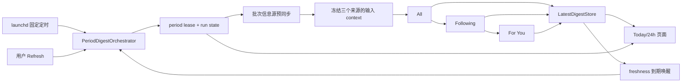
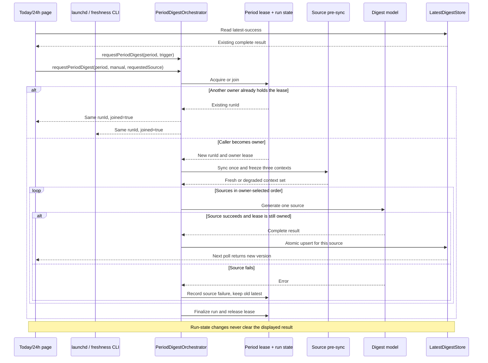

# Today/24h 摘要统一编排与持久化最新结果设计

## 文档状态

- 日期：2026-08-06
- 关联 Issue：[#50](https://github.com/friendfish/birdclaw/issues/50)
- 问题基线：`docs/superpowers/specs/2026-08-05-today-24h-digest-problem-statement.md`
- 选定方案：共享的持久化 period 编排器
- 范围：Today/24h 的定时、过期、手工生成，最新结果展示和 Config 配置

## 结论摘要

Today/24h 不再是历史归档，而是两个持续刷新的当前信息视图：

- Today/24h 各自按 period 形成一个批次；定时/过期批次按 All、Following、For You 生成，手工批次优先生成用户当前查看的来源。
- 定时、内容过期和手工刷新统一进入同一个跨进程 single-flight 编排器。
- 撞车请求加入当前批次，不拒绝、不排队，也不在当前批次结束后补跑第二次。
- 每个页面只读取对应 `period + contentSource` 的持久化 latest-success。
- 新任务运行或失败时继续显示旧内容；新来源结果完整生成后再原子替换。
- 每个批次开始时保留现有的信息源预同步，再基于同步后的本地数据生成。
- Today/24h 不再写日期归档，不再显示 Save，也不再包含 DM 开关。
- Yesterday/Week 继续按日期归档，承担历史查看和月/季/年批量分析的数据基础。

该方案不建设通用任务队列或常驻 Worker。现有 launchd 继续负责固定时间触发；两个动态 launchd agent 分别负责 Today/24h 内容过期的一次性到期唤醒。

## 目标体验

1. 用户每天早上打开 BirdClaw 时，可以直接阅读已经生成的 Today、24h 和 Yesterday。
2. Today/24h 支持固定定时、内容过期和手工刷新三种触发。
3. Config 可配置 Today/24h 固定时间和摘要有效时长；有效时长默认 12 小时。
4. 三种触发在同一 period 撞车时只执行一个批次。
5. 生成与页面生命周期解耦，切换 period/source 不取消任务。
6. 页面显示当前内容的实际生成时间。
7. 生成中、同步失败、单来源失败或跨日时，已有内容始终保留。
8. 页面优先显示当前逻辑页面的最新成功版本；新版本成功后才替换。
9. Today/24h 只保存持久化最新结果，不形成历史日期集合。
10. Yesterday/Week 的归档、历史选择和批量分析语义保持不变。

## 非目标

- 不建设通用持久化任务队列或常驻摘要 Worker。
- 不并行调用三个摘要模型。
- 不保证 Mac 休眠或关机期间仍能在墙钟时间前完成；launchd 在唤醒后按系统语义补跑。
- 不为 Today/24h 保留历史版本、日期选择器或手工 Save。
- 不删除已有 Today/24h 归档文件。
- 不移除 BirdClaw 其他页面或功能中的 DMs/Inbox 能力。
- 不改变 Yesterday/Week 的历史归档格式和读取方式。
- 不增加摘要内容截止时间配置；批次启动时使用当时可获得的最新信息源。

## 领域身份

### 逻辑页面身份

```text
period + contentSource
```

- `period` 仅为 `today | 24h`。
- `contentSource` 为 `all | following | for_you`。
- 本地当前账号是隐含运行上下文，不在 UI 中形成另一套页面维度。
- `includeDms` 不参与身份；Today/24h UI 和批次固定不包含 DMs。
- 模型、语言、prompt、reasoning、service tier、maxTweets 和 maxLinks 不参与页面身份。

### 批次身份

```text
period + runId
```

同一 period 同时最多有一个活动批次。Today 与 24h 是两个独立 period，可以同时运行。每个批次固定包含三个来源，但来源顺序由取得 lease 的首个触发决定：

- fixed scheduled / freshness：`All -> Following -> For You`；
- manual：当前页面的 `requestedSource` 优先，其余来源按上述默认顺序补齐；
- 加入已有批次的请求不能重排已经开始的批次。

### 结果版本身份

每个来源成功生成一次形成一个 `versionId`。版本记录包含：

- `period`、`contentSource`、`versionId`；
- `generatedAt` 和摘要窗口；
- Markdown、结构化 digest 和生成 context；
- 实际模型、语言、prompt hash、reasoning、service tier；
- 本次同步结果和所属 run ID；
- 本次生成输入限制。

生成参数用于解释结果版本，不用于页面查找当前内容。
最终批次状态只保存在 run state/audit 中，因为前面来源发布时，后续来源是否成功还未知；已发布版本不会为了补写最终批次状态而再次变更。

## 总体架构



### 主时序：撞车、逐来源发布与页面保留



### 模块迁移对照

| 模块 | 当前实现 | 目标实现 |
|---|---|---|
| 任务所有者 | Web stream、archive job 各自启动生成 | 所有入口调用同一个跨进程 orchestrator |
| 当前内容 | 生成参数参与 latest key，stale 时可能隐藏 | `period + contentSource` stable latest-success |
| 生成状态 | 与本次 HTTP/NDJSON 内容流耦合 | 持久化 run state，与正文正交 |
| freshness | 页面请求时判断并触发 | launchd 一次性唤醒为主，页面只做故障兜底 |
| Today/24h 存储 | latest cache 与日期归档并存 | 只保存持久化 latest-success；旧归档保持原样 |

### PeriodDigestOrchestrator

所有生成入口只调用一个共享接口：

```ts
requestPeriodDigest({ period, trigger, requestedSource? }):
  { runId: string; joined: boolean }
```

`trigger` 为 `scheduled | freshness | manual`。`requestedSource` 只允许 manual 传入，并且只影响新 owner 批次的来源顺序，不参与批次身份、结果身份或碰撞判定。触发来源只用于审计和 UI，不改变结果优先级。去除 Today/24h 归档后，`scheduled` 不再拥有特殊的存档覆盖权限。

编排器负责：

1. 查询同 period 的持久化 run state 和跨进程 lease。
2. 如果已有有效批次，返回相同 run ID，调用方进入观察状态。
3. 如果没有活动批次，取得 lease、创建 run state 并成为 owner。
4. 预同步一次信息源，随后冻结三个来源的输入 context。
5. 串行生成三个来源，每个来源成功后独立发布 latest-success。
6. 完成审计、释放 lease，并保留最终 run state 供 UI 查看。

跨进程的“加入”不是共享内存 Promise。加入者通过相同 run ID 观察持久化 run state 和 latest-success；只有 lease owner 执行同步和模型调用。

### DigestRunStateStore

run state 按 period 持久化，复用现有 PID、host、owner ID、heartbeat 和绝对最长运行时间的可靠性规则。建议路径：

```text
~/.birdclaw/runs/period-digest-today.json
~/.birdclaw/runs/period-digest-24h.json
```

状态至少包含：

```ts
interface PeriodDigestRunState {
  schemaVersion: 1;
  runId: string;
  period: "today" | "24h";
  startedBy: "scheduled" | "freshness" | "manual";
  joinedTriggers: Array<"scheduled" | "freshness" | "manual">;
  prioritySource?: "all" | "following" | "for_you";
  ownerId: string;
  pid: number;
  host: string;
  startedAt: string;
  heartbeatAt: string;
  phase: "syncing" | "preparing" | "generating" | "completed" | "degraded" | "failed";
  currentSource?: "all" | "following" | "for_you";
  sources: Record<ContentSource, SourceRunState>;
  sync?: DigestSyncResult;
  error?: string;
  finishedAt?: string;
}
```

`joinedTriggers` 只用于可观察性；并发写入失败不能影响任务正确性，也不改变 owner。

### LatestDigestStore

使用 `sync_cache` 中稳定、可读的逻辑 key 保存当前版本：

```text
period-digest-current:v1:today:all
period-digest-current:v1:today:following
period-digest-current:v1:today:for_you
period-digest-current:v1:24h:all
period-digest-current:v1:24h:following
period-digest-current:v1:24h:for_you
```

一个 key 的 JSON 包含完整结果版本。SQLite 单行 upsert 是发布原子边界：写入成功后页面看到全部新内容，写入前和失败后仍看到旧内容。

底层按输入 hash 保存的精确生成缓存可以继续用于其他能力，但不再作为页面 latest-success 指针。编排批次固定强制执行一次新的模型生成，避免复用旧输出后 `generatedAt` 不前进而立即再次过期。

## 批次执行流程

### 1. 获取或加入批次

- lease 粒度是 period，不是 source。
- 同 period 的 scheduled、freshness、manual 请求撞车时返回同一 run ID。
- 撞车请求不报错、不等待排队，也不登记批次结束后的补跑。
- 当前批次运行期间再次点击 Refresh 不产生第二次生成。
- Today 与 24h 可以独立取得各自 lease。

### 2. 信息源同步与输入冻结

批次保留现有定时摘要的信息源同步能力：

1. 使用 Config 管理的非交互 X 凭据执行一次 Following、For You、mentions 和相关 thread 预同步。
2. 同步完成后，以统一的 `windowResolvedAt` 解析 Today 或 24h 窗口。
3. 立即收集并冻结 All、Following、For You 三份 context。
4. 三次模型调用均设置 `liveSync:false`，不在每个来源内重复访问 X。

这样“多一次信息同步”是相对于信息源自身定时/手工同步的额外刷新，不是一个批次内重复三次同步。

如果预同步部分或全部失败，批次使用本地已有数据继续生成，并将同步状态标记为 `degraded`。严格凭据路径继续禁止浏览器 Cookie 探测和 Chrome Safe Storage 弹窗。

### 3. 来源生成与发布

三个来源按 owner 创建时确定的顺序依次执行，并沿用有界重试和单次模型超时。manual owner 将当前 `requestedSource` 放在第一位；scheduled/freshness owner 使用默认顺序。后续 join 不改变顺序。

- 成功：立即写入该来源 stable latest key，页面可在批次结束前看到新版本。
- 失败：保留该来源旧 latest-success，记录错误，然后继续下一个来源。
- 同步 degraded，或一个/两个来源失败但至少一个来源成功：批次最终为 `degraded`。
- 三个来源都失败或批次级准备失败：批次最终为 `failed`。
- 只有同步成功且三个来源全部成功时，批次最终为 `ok`。
- 不自动排队重跑；下一次 scheduled、freshness 或 manual 触发可以重试。

run state 和 latest-success 是两个独立状态面。生成状态变化永远不删除内容。

## 三种触发

### 固定定时

Today/24h 继续由 launchd 按 Config 时间启动独立 CLI 进程。新命令语义为“生成并发布当前摘要”，不再写归档。

建议新增：

```text
birdclaw jobs run-period-digest --period today
birdclaw jobs run-period-digest --period 24h
```

为了兼容升级前已安装的 plist，旧命令 `run-digest-archive --period today|24h` 暂时委托给新编排器并返回 `archived:false`，但不写日期文件。新安装或 Config 保存后的 plist 使用新命令。

Yesterday/Week 继续调用现有 `run-digest-archive` 并落盘。

### 手工刷新

任一 Today/24h source 页面的 Refresh 都请求整个 period 批次，而不是只生成当前 source：

- 按钮在当前 period 已运行时禁用。
- 请求携带当前 `contentSource` 作为 `requestedSource`；如果它成为 owner，该来源优先生成和发布。
- 请求立即返回 run ID；模型任务不绑定 HTTP 连接或 React 组件。
- 页面切换只停止当前页面轮询，不取消服务端批次。
- 返回页面后通过 run state 继续观察。
- 如果请求加入已经运行的批次，沿用原批次顺序，不中断或重排正在执行的来源。

### 内容过期

Config 保存一个共享的 `digest.freshnessSeconds`，默认值改为 43,200 秒（12 小时）。每个逻辑页面计算：

```text
baseAt = 当天 latest-success.generatedAt
         或当天该 period 的配置定时时刻

expiresAt = baseAt + freshnessSeconds
```

规则如下：

1. 如果有当天成功内容，以其实际 `generatedAt` 为准。
2. 如果当天尚无成功内容，以配置的固定定时时刻为默认基准。
3. Config 修改有效时长后，立即按当前版本重新计算。
4. 新来源版本发布后，立即按新 `generatedAt` 重新计算。
5. `expiresAt` 只有仍位于 `baseAt` 的同一自然日才有效；跨天则不安排。
6. 三个来源分别计算，编排器只注册最早的有效到期时间；到期后触发一次完整 period 批次。
7. 到期时存在其他触发的批次，则加入该批次，不产生第二次生成。

公式本身不会执行任务，因此系统为每个 period 维护一个动态 launchd 一次性唤醒。它不是周期轮询器，也不依赖 Web 后端常驻：

- Config 保存、应用启动/升级和批次结束时重新计算，并安装、更新或卸载对应 agent。来源发布只更新本批次的候选到期点，批次 finalization 最多重装一次 agent。
- 精确 `expiresAt` 向上取整到下一分钟形成 `wakeAt`，agent 的 `StartCalendarInterval` 指向 `wakeAt`；CLI 仍用未取整的 `expiresAt` 校验，因此不会提前消费 token。
- 同 period 的 plist 更新使用 scheduler lease 串行化，先写临时文件并原子替换，再执行 launchctl 更新，避免 Config 保存和批次结束并发覆盖。
- 更新失败时保留最后一个已成功安装的 agent（如果存在），并在 scheduler state、run audit 和 Config 状态中记录 `degraded`；失败不能被顶层 `ok:true` 隐藏。
- agent 到点后调用 `run-period-digest --trigger freshness --attempt-token <token>`。
- CLI 在取得编排 lease 前重新读取 stable latest 和 Config，校验 token、自然日和当前 `expiresAt`；过时 agent 只记录 no-op，不能错误生成。
- 同日到期时 Mac 正在休眠，launchd 在唤醒后按系统语义补启动；CLI 随后执行有效性校验。
- 如果唤醒时已经跨日，该 token 作废并退出，由新一天固定定时负责。
- 一次性任务触发、no-op、应用启动或升级后执行 reconcile，避免旧日历项在未来重复执行，并修复上次安装失败。

为避免失败版本形成即时重试循环，持久化一个 freshness attempt token：

```text
token = page identity + versionId/scheduled-base + freshnessSeconds
```

任何批次在该 token 已过期后开始时，都视为已经消费该次过期机会。即使该来源本轮失败，相同 token 也不会再次自动触发；固定定时或用户 Refresh 仍可重试。部分成功批次在 finalization 时按成功来源的新版本计算下一次截止点，并暂时抑制失败来源未变化的旧版本；失败来源在后续发布新版本或 Config 时长变化后重新参与计算。这样既不会因 degraded 批次永久停止 freshness，也不会对同一个失败版本立即循环重试。

freshness agent 和固定定时 agent 都独立于 Web 后端运行；两者在撞车时仍通过同一个 period lease 加入同一批次。

页面兜底不替代后台调度：state API 仍是只读接口；页面发现内容 stale、没有活动批次且对应 attempt token 尚未消费时，可以调用与 CLI 相同的 freshness POST 入口。该请求仍进入 orchestrator，撞车即 join，并由 attempt token 保证同一版本不会因反复切页而重复触发。这样 launchd 失效时打开页面可以自愈，但正常 freshness 不依赖页面访问。

### 自动生成频次与成本边界

默认 12 小时 freshness、早间固定定时且不跨日时，每个 period 每天最多一个 fixed batch 和一个 freshness batch；Today/24h 合计最多四个自动批次、十二次模型调用。手工 Refresh 不计入该估算，但仍受 single-flight 限制。

Config 将 freshness 限定为 1 至 24 小时，并在保存前展示按当前固定时间推算的每日自动批次数和模型调用数。自定义时长下，同日 freshness 轮数按当前版本的 `generatedAt + freshness` 连续推算；系统不另设会阻止手工 Refresh 的每日硬上限。attempt token 解决失败重试风暴，配置下限解决过小间隔造成的正常成功高频循环。

## 页面与 API

### 权威读取模型

Today/24h 页面只组合两份服务端数据：

- 当前 `period + contentSource` 的 latest-success；
- 当前 period 的 run state 和 freshness 状态。

页面不再：

- 在请求开始时清空 Markdown/context/result；
- 因缓存 stale 而隐藏结果；
- 优先读取活动归档文件；
- 从 NDJSON 流中的临时 Markdown 推断当前内容；
- 使用 `includeDms` 参与 query key。

建议将状态接口收敛为：

```text
GET  /api/period-digest-state?period=today&contentSource=all
POST /api/period-digest-runs
```

GET 返回 latest-success、run state、是否 stale、`expiresAt`、attempt token 状态和最近错误。POST 接受 `period`、trigger，以及 manual 请求的 `requestedSource`，返回 `{ runId, joined }`。现有 stream/metadata API 在页面迁移后移除或保留内部兼容层，不能继续作为第二个任务所有者。

### 展示状态

有历史成功内容时，正文始终渲染。状态区独立展示：

- `Generated <local time>`；
- 当前 period 正在更新时的阶段和 `N/3` 进度；
- 内容来自前一自然日或当天已过期时的 Outdated 状态；
- 最近批次 degraded/failed 时的同步或来源错误。

成功来源完成后，React Query 刷新 stable latest，原子替换正文。失败来源继续显示原内容和原生成时间。

首次使用且六个 stable key 均无内容时，页面可以显示首次生成进度或明确错误；系统不能伪造不存在的摘要。

### UI 调整

- 移除 Today/24h 的 DMs checkbox。
- 移除六个 Save 按钮、Saved 状态和替换错误提示。
- 保留每个页面的 Refresh；它触发当前 period 的三来源批次。
- Refresh、period/source 切换和轮询都不能改变现有正文，除非读取到新的完整 latest-success。

## Config 设计

Schedule 区域继续配置四个固定时间，并新增摘要有效时长：

- `Today schedule`
- `24h schedule`
- `Yesterday archive schedule`
- `Week archive schedule`
- `Today/24h freshness`，默认 12 小时
- `Archive directory`，辅助文案明确为“用于 Yesterday/Week；已有 Today/24h 文件仍可在此访问，但新页面不再使用”

保存后：

1. 校验有效时长为 1 至 24 小时，并展示当前计划对应的自动批次/模型调用估算。
2. 写入 Config。
3. 更新 Today/24h 的 current-digest launchd agent。
4. 更新 Yesterday/Week 的 archive agent。
5. 通知 freshness scheduler 立即重新计算。
6. 返回每个 agent 的安装结果；任何安装失败不能被顶层 `ok:true` 隐藏。

Config 同时展示 Today/24h 最近批次状态、固定计划时间和当前有效 `expiresAt`，使“是否安装、何时再运行、上次是否失败”可以从页面闭环判断。

## Today/24h 去归档

### 新行为

- Today/24h 定时批次只写 stable latest-success 和 run audit。
- 不再写 `<archiveDir>/<date>/today-*` 或 `24h-*` JSON/Markdown。
- `/api/digest-archive-dates` 和 `/api/digest-archive-entry` 只接受 Yesterday/Week；Today/24h 返回明确的 unsupported 错误，不能静默映射成其他 period。
- 移除 `/api/digest-archive-save` 及其路由、客户端调用和测试。

### 遗留文件

已有 Today/24h 日期归档保持原样：

- 升级不删除、不改写、不迁移这些文件。
- 新页面和 API 不读取这些文件。
- 用户仍可在归档目录手工访问。
- Yesterday/Week 同目录文件继续正常工作。

## 旧缓存迁移

新 stable key 首次上线时不能让已有页面突然变空。迁移只读取旧 `sync_cache`，不读取遗留归档文件：

1. 如果某个 stable key 已存在，直接使用，不做迁移。
2. 枚举 `period-digest-latest:%` 旧缓存行并校验 JSON schema。
3. 只接受 `context.includeDms=false` 的条目。
4. 旧 schema 没有显式 period，只能通过冻结的迁移兼容表 `LEGACY_PERIOD_LABELS = { Today: "today", "Last 24 hours": "24h" }` 映射；该常量不复用 UI/prompt 展示文案。通过 `context.contentSource` 映射 source。
5. 对每个逻辑页面选择 `result.updatedAt` 最新的有效条目，复制到 stable key，并标记 `migratedFromLegacy:true`。
6. 无法确定身份或内容损坏的条目跳过、不删除旧行，并记录可见的 migration diagnostic，不能静默失败。
7. stable key 建立后不再执行该页面的迁移。

迁移结果即使已经 stale 也可展示；stale 只影响后台触发，不影响内容可见性。

## 错误处理与恢复

### 同步失败

- 使用本地已有数据继续生成。
- run state 和结果版本记录 `degraded` 及脱敏错误。
- 不回退浏览器 Cookie 或 Keychain。

### 单来源失败

- 保留该来源旧 latest-success。
- 继续生成后续来源。
- 页面显示最近失败，但正文不清空。
- 不自动排队重跑。

### 批次级失败

- context 准备、配置解析、凭据文件读取或 lease 丢失等批次级错误终止剩余步骤。
- 六个 stable latest key 均不因失败被删除。
- 最终 run state 和 audit 保存批次错误。

### 进程退出、休眠和 lease 恢复

- owner 定时刷新 lease 和 run heartbeat。
- 本机 PID 存活优先于休眠期间停摆的 heartbeat。
- PID 消失时立即允许回收；绝对最长运行时间防止 PID 复用永久占锁。
- owner 丢失 lease 时中止剩余模型/发布步骤，不能继续越权写入。
- 新 owner 不恢复半个模型流；下一次触发创建新 run，旧内容保持可读。

### 模型超时

- 每个来源保留有界超时和有限重试。
- AbortSignal 与 owner fiber 中断联动，丢 lease 时停止在途请求，避免继续消耗模型调用。

## 可观察性与审计

Today/24h audit 从“archive job”语义改为“current digest run”，至少记录：

- run ID、period、startedBy 和 joined triggers；
- 固定定时、freshness 或手工触发时间；
- 同步步骤及 transport、count、degraded error；
- 三个来源的 attempts、generatedAt、versionId 和错误；
- startedAt、finishedAt、duration、最终状态；
- joined/skipped 行为，但不得把 join 记成失败。

审计、run state 和 API 错误继续执行凭据与敏感参数脱敏。

## 测试策略

### 单元测试

- 页面身份只包含 period/source，不包含生成参数或 DMs。
- stable latest key 六种组合固定且不含日期。
- latest-success upsert 原子替换，失败保留旧值。
- 旧缓存迁移使用冻结的 legacy label 兼容表选择正确 period/source、排除 DMs、选择最新有效版本，并报告无法识别的条目。
- freshness 默认 12 小时、Config 修改重算、成功发布重算。
- 三个 source 取最早同日到期点；跨日不安排。
- attempt token 防止失败版本即时循环，同时允许固定定时和手工重试。
- freshness launchd 的分钟向上取整、串行原子安装、安装失败可见性、过时 token no-op、同日休眠补跑和跨日失效。
- run state 的 owner、heartbeat、PID、绝对上限和 owner-safe 更新。

### 编排集成测试

- scheduled + manual、scheduled + freshness、manual + freshness 和三者同时撞车都只调用一次预同步和三次模型生成。
- 两个 Web 请求和 Web + CLI 跨进程请求加入同一 run ID。
- 撞车期间不排队第二个批次。
- 一个来源失败后另外两个继续，成功来源分别发布，失败来源保留旧值。
- 预同步失败时使用本地 context 并标记 degraded。
- 切换页面或断开 HTTP 连接不取消 owner 批次。
- Today 与 24h 可各自运行，不共享错误状态。

### API/UI 测试

- state API 在 fresh、stale、generating、degraded、failed 时始终返回已有 latest-success。
- Refresh 触发整个 period 批次并在活动期间禁用。
- manual owner 优先生成当前 requestedSource；join 已有批次时不重排。
- 手工刷新开始、定时开始和 freshness 开始均不清空 Markdown。
- 来源成功后才替换正文；失败时保留原时间戳和正文。
- 跨日未生成时显示前一日 latest-success 和明确时间/Outdated 状态。
- Today/24h 无 DM 开关、无 Save；Yesterday/Week 历史 UI 不回归。
- Config 保存 freshness 和计划时间，并呈现每个 agent 的真实安装结果。
- launchd 不可用时页面 stale 兜底通过同一 attempt token 最多触发一次，并保持旧正文。

### CLI/launchd 测试

- Today/24h 新 plist 调用 current-digest 命令。
- 旧 archive 命令的 Today/24h 调用委托新编排器但不写文件。
- Yesterday/Week 仍生成 JSON/Markdown 归档。
- 无凭据或无效凭据路径产生可见、脱敏失败，不触发 Chrome Safe Storage。

## 验收场景

| 场景 | 预期 |
|---|---|
| 固定定时前已经有手工/过期结果 | 继续显示该最新结果 |
| 固定定时启动但未完成 | 继续显示原结果并显示 Updating |
| 当前来源在定时批次中完成 | 原子切换到该新结果 |
| 当天尚未成功生成 | 显示跨日保留的最后成功结果 |
| freshness 到期并开始生成 | 原内容保持直到新版本成功 |
| 手工 Refresh | 触发 period 批次，原内容保持 |
| For You 手工 Refresh 成为 owner | For You 先生成发布，随后完成另外两个来源 |
| 三种触发撞车 | 一个 run ID、一次同步、一个三来源批次 |
| 一个来源失败 | 该来源保持旧内容，另外两个继续更新 |
| 批次全部失败 | 所有页面保持旧内容并显示失败 |
| 首次安装从未成功 | 显示首次生成/错误状态，不伪造正文 |
| 新自然日定时尚未完成 | 显示上一日最后成功内容和实际生成时间 |
| 旧 Today/24h 归档存在 | 文件保留，但新页面/API 不读取和写入 |
| freshness agent 安装失败 | Config/状态显示 degraded；旧 agent、启动 reconcile 或页面兜底负责恢复 |

## 方案取舍

未选择“继续修补 archive job + Web stream”方案，因为它继续保留两个任务所有者，无法可靠实现跨进程 single-flight。

未选择常驻 Worker/通用队列方案，因为当前只有 Today/24h 两个 period，持久化 lease、run state 和 stable latest 已能覆盖碰撞、恢复和页面观察；引入 Worker 会额外增加进程生命周期、队列恢复和部署成本。

选择共享编排器后，系统仍有两个执行载体：launchd CLI 和 Web 后端，但它们共享同一个 lease、run state、输入流程和发布存储，因此不再形成两套业务状态机。

## 实施边界

实现应优先复用并重命名现有可靠能力：

- `scheduled-job` 的 owner-safe lease、PID 和 heartbeat；
- digest archive run state 的持久化与状态轮询模式；
- `digest-archive-sync` 的批次预同步；
- `sync_cache` 的 SQLite 原子 upsert；
- Today 页面现有生成时间和进度展示。

需要删除或退出 Today/24h 流程的能力：

- Web 进程内 active registry 作为任务所有者；
- 页面以 NDJSON 临时流作为当前正文；
- Today/24h 活动 archive 优先读取；
- Today/24h Save API/UI；
- Today/24h 日期归档写入；
- Today/24h DMs toggle。

实现计划必须按“存储与身份 -> 编排器 -> 三种触发 -> API/UI -> 去归档与兼容 -> 验证”的顺序推进，避免再次只修局部入口。
