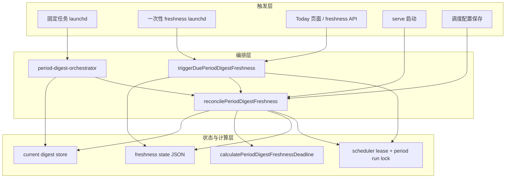
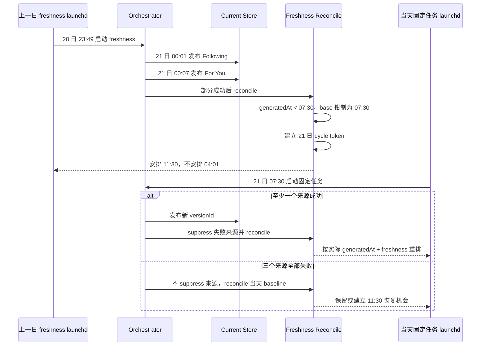
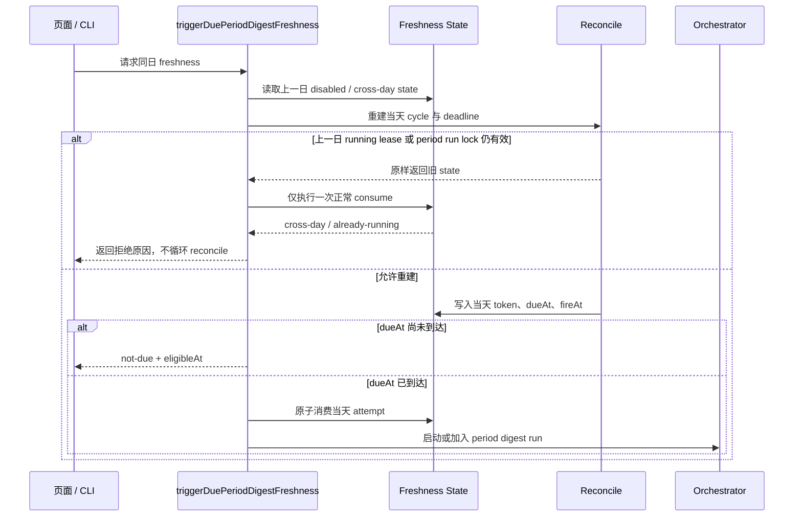

# Issue #62: 跨午夜 Freshness 当日基线设计

## 文档状态

- 日期：2026-08-22
- 关联 Issue：[#62](https://github.com/friendfish/birdclaw/issues/62)
- 评审 PR：[#63](https://github.com/friendfish/birdclaw/pull/63)
- 选定方案：来源时间钳制 + 每日 cycle token + 真实触发入口重建
- 范围：Today/24h deadline 计算、跨日状态重建、固定任务全量失败恢复和回归测试

## 结论摘要

Today/24h freshness 只负责同一自然日内的信息实时性。自然日切换后，当天固定任务
拥有首轮生成优先级；上一日 freshness 即使跨午夜完成部分来源，也不能在当天固定
任务之前再次触发。

每个未抑制来源使用以下基线：

```text
effectiveBase = max(scheduledBase, valid same-day generatedAt)
sourceDeadline = effectiveBase + freshnessSeconds
```

同时，仅修改 deadline 计算不足以覆盖真实生产入口。方案还会：

1. 把当天 `scheduledBase` 纳入 attempt token，使相同来源版本在不同自然日属于不同 cycle。
2. 只在同一 cycle 内继承 `suppressedSourceIdentities`，新自然日不会沿用上一日 suppression。
3. 页面/CLI freshness 入口遇到上一日 state 时，先 reconcile 出当天 baseline，再判断是否到期。
4. 当天固定任务全部来源失败时，orchestrator 仍 reconcile 一次，不抑制旧来源，为
   `scheduledBase + freshnessSeconds` 保留恢复机会。

不新增持久化字段，不升级 state schema，也不改变 retry、page recovery、锁和 launchd
交接机制。

## 功能与场景拆解

### 1. 跨午夜完成

上一日 23:49 启动的 freshness 在 00:01、00:07 发布来源时，这些 `generatedAt`
虽然属于新一天，但早于新一天 07:30 的固定时刻。它们统一使用 07:30 作为
effective base，4 小时 freshness 对应 11:30，不再产生 04:01/04:07 的触发。

### 2. 当天固定任务成功或部分成功

固定任务在 scheduledBase 之后发布的新来源使用各自实际 `generatedAt`。任一来源
成功发布后，新的 `versionId` 形成新的 attempt token；失败来源沿用现有 suppression
规则，不参与本轮最小 deadline。成功来源按最早的实际生成时间安排下一次 freshness。

### 3. 当天固定任务全量失败

全量失败没有新 `versionId`，但仍需要同日恢复。scheduled owner 完成失败状态后调用
freshness reconciliation，使用旧 current digest 和当天 scheduledBase 建立当日 cycle。
此时不把三个失败来源全部 suppress，否则候选集为空会错误地禁用恢复。

如果已有同日 freshness attempt 正在运行，现有 running lease、period run lock 和
completion retry 继续拥有优先权；reconcile 不重置同一个 attempt。

### 4. 休眠漏过固定时刻

机器在 scheduledBase 之后恢复时，serve 启动 reconciliation 或页面/CLI freshness
入口会把上一日 state 重建为当天 cycle。若 `scheduledBase + freshnessSeconds` 已过，
launchd 计划按现有 overdue 规则钳制到下一可用分钟；页面/CLI 入口还可在取得 state
锁后直接消费已到期 attempt。二者仍由 token 和锁去重。

### 5. 手工生成

- scheduledBase 之前成功的手工生成使用 scheduledBase，不能取代当天固定任务边界。
- scheduledBase 之后成功的手工生成使用实际 `generatedAt`，正常延后该来源 freshness。
- 手工生成全量失败不单独建立 baseline；当天 cycle 由固定任务、serve 或跨日 trigger
  入口建立。

### 6. 跨日终止

上一自然日的 `dueAt` 仍不能执行。consume 对未重建的旧 token 继续返回 `cross-day`；
一旦真实入口完成 reconciliation，新 cycle 使用新 token，因此残留的旧 launchd 命令
只能得到 `token-mismatch`，不能消费当天 attempt。

## 分层现状架构



当前缺口位于两层交界处：计算层没有 scheduledBase 下限；触发层只在 state 缺失时
reconcile；编排层只在至少一个来源成功时 reconcile。三者叠加后，直接调用计算函数
的测试可以通过，但跨日残留 state 和固定任务全量失败的生产路径仍可能没有当天 attempt。

## 以变化为中心的 As-Is / To-Be

| 变化点 | As-Is | To-Be |
|---|---|---|
| 来源有效基线 | 当天任意 `generatedAt`，包括 00:01 | 当天且不早于 scheduledBase 的 `generatedAt`，否则 scheduledBase |
| attempt cycle | token 不显式包含自然日；来源版本不变时可能复用旧 token | token 始终包含当天 `scheduledBase.toISOString()` |
| suppression 生命周期 | 相同 version identity 的 suppression 可跨日继承 | 仅同一 scheduledBase cycle 内继承；新一天从空 suppression 开始 |
| 跨日页面/CLI 触发 | 仅 state 缺失时 reconcile；旧 `disabled/cross-day` 直接返回 | state 属于更早自然日时先 reconcile，再 consume 当天 state |
| 固定任务全量失败 | `completedSources === 0` 时不 reconcile | scheduled trigger 全量失败仍 reconcile，且不 suppress 全部来源 |
| 固定任务部分成功 | 成功后 reconcile，失败来源被 suppress | 保持现状，成功来源实际时间决定 deadline |
| 上一日 launchd token | state 未重建时返回 cross-day | state 重建后因每日 token 不同返回 token-mismatch |

### Deadline 计算

As-Is：

```ts
const base =
  Number.isFinite(generated.getTime()) && sameLocalDay(generated, now)
    ? generated
    : scheduledBase;
```

To-Be：

```ts
const generatedIsEligible =
  Number.isFinite(generated.getTime()) &&
  sameLocalDay(generated, now) &&
  generated.getTime() >= scheduledBase.getTime();
const base = generatedIsEligible ? generated : scheduledBase;
```

### 每日 attempt identity

attempt token 的 hash 输入增加：

```ts
cycleBase: scheduledBase.toISOString()
```

同一 publication 自身的 `versionId` 不变，但跨午夜 publication 会产生新的
`versionId`，固定任务后续发布又产生另一组新 `versionId`。`cycleBase` 解决的是另一种
情况：当天没有新 publication 时，仍必须把旧来源版本置于新的自然日 attempt 生命周期。

previous state 的 `suppressedSourceIdentities` 也必须以同一 cycle 为继承条件。显式传入的
`suppressSources` 仍作用于当前 reconciliation；只有从 previous state 自动恢复的
suppression 会在 cycle 日变化时清空。这样同一日部分失败仍被抑制，而上一日失败不会
让新一天的 baseline 缺少候选来源。

“同一 cycle”复用下文“跨日 state 识别”的规则：有效 `dueAt` 所在本地自然日优先，
否则使用 `updatedAt` 所在本地自然日。previous cycle 日只有与 calculationNow 属于
同一本地自然日时，才允许按 freshnessSeconds 和 version identity 继承 suppression。
这不是可选清理：如果上一日三个来源都被 suppress 且 version 未变，新一天固定任务
又全量失败，跨日继承会让候选集为空、deadline 变成 `null`，直接抵消全量失败恢复。

`sourceIdentities` 中现有的 `scheduled:${scheduledBase.toISOString()}` fallback 继续保留，
它只为“该来源从未有 current digest”提供来源身份。新增的顶层 `cycleBase` 对所有来源
生效，用来区分自然日生命周期；两者职责不同，不能互相替代。

### 跨日 state 识别

trigger 读取 state 后按以下顺序决定是否重建：

1. `dueAt` 是有效时间时，以 `dueAt` 的本地自然日作为 state cycle 日。
2. `dueAt` 为空或无效时，以 `updatedAt` 的本地自然日作为 disabled state 的 cycle 日。
3. cycle 日早于 `now` 的本地自然日时调用 reconciliation。
4. cycle 日等于今天时保留现状；未来日期不擅自覆盖，仍由 consume 拒绝。

这能同时识别前一日普通 dueAt、前一日 `dueAt: ""` 的 disabled state，以及前一日
任务跨午夜完成后才更新的 state。无需新增 `cycleDate` 持久化字段。

## 跨午夜时序



分步说明：

1. 跨午夜成功来源仍正常发布，数据不回滚。
2. reconciliation 以 21 日 07:30 为时间下限，并以该 scheduledBase 区分每日 cycle。
3. 因此 07:30 固定任务始终先于 freshness eligibility。
4. 固定任务成功后以新内容重排；全量失败则保留 scheduledBase fallback。

## 跨日触发重建时序



## 编排与数据流

### Reconciliation

`reconcilePeriodDigestFreshnessInternal` 继续读取三个 current digest，计算来源时间、
source identities 和 suppression identities。变化只有 deadline 下限与 token 的
`cycleBase` 输入，以及 previous suppression 只在同一 cycle 内继承。schemaVersion 和
state 文件结构保持不变。

### Scheduled 全量失败

orchestrator 的完成分支改为：

- `completedSources > 0`：保持现有 reconciliation，失败来源进入 suppression。
- `completedSources === 0 && request.trigger === "scheduled"`：调用 reconciliation，
  使用 `replaceRunningAttempt: true`，但不传 `suppressSources`。
- freshness 全量失败：保持现有路径，由 completion 回写进入 retryable/failed。
- manual 全量失败：不建立新的 freshness attempt。

reconciliation 失败仍被吞掉，不覆盖摘要批次的真实 phase；state 安装错误继续记录为
`error`，由现有页面恢复机制处理。

### Trigger 跨日重建

`triggerDuePeriodDigestFreshness` 在 `disabled` 早返回和 consume 之前检查 state cycle。
缺失或属于更早自然日的 state 通过同一个 reconciliation API 重建。重建与 consume
分别取得现有 scheduler lease；中间若有另一个进程完成 reconciliation，稳定的每日
token 和锁仍会收敛到同一个 attempt。

reconciliation 可能因 previous state 仍为 `running` 且 running lease 未过期，或真实
period run lock 仍存在，而原样返回上一日 state。trigger 不把“调用成功”误判为“已经
重建”，也不进入重试循环；它只把返回的 state 交给一次正常 consume，并传播
`cross-day` 或 `already-running`。当前运行结束后的 publication reconciliation、
completion 回写或下一次页面请求再负责建立当天 cycle。

页面触发的跨日 reconciliation 保留默认 direct `installLaunchAgent`。这会让当天第一次
页面请求同步执行一次 launchctl，可能增加少量延迟，但能确保页面关闭后仍有后台任务。
不传 `deferLaunchAgentReload: true`：该选项会创建 helper 并等待调用者 PID 退出；在 web
server 中调用会等待常驻 server 进程，最长 6 小时，反而延迟当天 freshness。

## 验收标准重述

Issue 中“07:00/07:30 前不会因跨午夜结果生成 freshness deadline”按可执行语义重述为：

- 系统可以在固定时刻前持久化当天 deadline，以便 launchd 安装和失败恢复；
- 该 deadline 不得早于 `scheduledBase + freshnessSeconds`；
- 因此固定任务必然先到达，freshness 在固定时刻前既不能到期也不能触发；
- 固定任务成功后 deadline 按实际生成时间更新，固定任务全量失败后 baseline deadline
  仍作为同日恢复机会。

## 晚时刻配置的明确后果

现有规则要求 deadline 与 `now` 属于同一本地自然日。因此当
`scheduledBase + freshnessSeconds` 跨午夜时，例如 21:00 + 4 小时，计算结果全天为
`null`，freshness state 为 `disabled`。钳制后所有当天候选都不会早于 21:00，所以这类
配置不是偶发禁用，而是确定性地全天禁用 freshness。

本次不把 deadline 截断到 23:59，也不允许跨日执行，因为那会重新引入固定任务与
前一日 freshness 的归属冲突。用户若需要同日 freshness，必须配置满足
`scheduledBase + freshnessSeconds` 不跨午夜的组合。

## 错误处理与兼容性

- 缺失、无效、上一日或早于 scheduledBase 的 `generatedAt` 使用 scheduledBase。
- scheduled 批次在 pre-sync、凭证读取、context 收集等批次级阶段抛异常时，只要 owner
  仍能成功写入 failed state，就用 `replaceRunningAttempt: true` reconciliation 建立当天
  baseline；reconciliation 错误继续被吞掉，不覆盖批次失败原因。ownership 已丢失时不
  reconciliation，避免旧 owner 覆盖新 owner 的状态。
- persisted freshness state 的 `dueAt` 与 `updatedAt` 都无法解析时，cycle 无法归属，按
  陈旧 state 处理并重建，而不是永久返回 cross-day。
- 页面/CLI trigger 的跨日 reconciliation 若因 scheduler lease 超时或其他异常失败，返回
  `{ triggered: false, reason: "reconcile-error" }`；不消费旧 token，也不让页面请求变成
  500。下一次页面轮询仍可重试。
- deadline 跨本地午夜继续返回 `null` 并写入 disabled state。
- 不修改 persisted state schema；旧 state 首次 reconciliation 时生成新的每日 token。
- 升级前残留 launchd 使用旧 token，无法消费升级后或新一天的 attempt。
- 上一日进入 retryable 或等待 reloader 的 pending attempt 在跨午夜后视为放弃；若当天
  cycle 已重建则激活得到 token-mismatch，未重建时仍被 cross-day 规则拒绝。reloader
  无论激活结果如何都会 unlink helper plist 并移除 helper label，不遗留调度项。
- token mismatch、already-running、retryable、page recovery、reloader 和跨进程锁行为
  保持现有契约。
- 本地时区和 DST 继续沿用 JavaScript Date 与 launchd calendar 的现有语义，不引入
  UTC 自然日。

## 测试

### Deadline 单测

1. 24h 07:30、freshness 4 小时、00:01/00:07 跨午夜完成且 all 被 suppress 时，
   deadline 为 11:30。
2. Today 在 07:00 前手工生成时，deadline 为 11:00；07:00 后生成使用实际时间。
3. 固定任务在 07:33 至 07:35 发布时，最早成功来源产生 11:33 deadline。
4. 21:00 + 4 小时返回 `null`，明确覆盖全天 disabled 配置。

### Trigger 与 state 单测

5. 前一日有效 dueAt state 通过页面/CLI trigger 重建为当天 token，而不是返回 cross-day。
6. 前一日 `dueAt: ""` 的 disabled state 通过 `updatedAt` 识别并重建。
7. 当天 disabled state 不反复 reconcile；未来日期 state 不被覆盖。
8. 旧 launchd token 在当天 state 重建后返回 token-mismatch。
9. 休眠到 12:00 后重建得到已过期的 11:30 dueAt，launchd fireAt 使用下一可用分钟，
   页面 trigger 只能原子启动一次。
10. 上一日相同 version identity 的 suppression 不进入当天 cycle；同日 suppression
    仍持续到该来源发布新 version。

### Orchestrator 单测

11. scheduled 固定任务全量失败时调用 reconciliation，传
    `replaceRunningAttempt: true` 且不 suppress 三个旧来源。
12. freshness 全量失败仍不由 orchestrator reconciliation 重置 attempt，继续由
    completion retry 状态机处理。
13. manual 全量失败不触发 reconciliation，也不建立新的 freshness attempt。
14. 部分成功继续 suppress 失败来源，并按成功来源实际时间重排。
15. scheduled 在 pre-sync 等批次级阶段抛异常时仍 reconciliation 当天 baseline；
    freshness/manual 的批次级异常不建立新 attempt。

### 损坏状态与错误边界单测

16. `dueAt` 与 `updatedAt` 都不可解析的 persisted state 会先重建，再按当天 deadline
    返回 not-due 或触发，不会永久 cross-day。
17. 跨日 reconciliation 抛异常时 trigger 返回 `reconcile-error`，不调用 requestRun，
    route 仍返回成功响应而不是 500。
18. 21:00 固定时刻、4 小时 freshness、当天 21:00 前生成的候选经钳制后跨午夜，明确
    断言 deadline 为 `null`。

### 回归验证

19. 跨午夜完成 -> 07:30 固定任务成功 -> 新 deadline 按实际生成时间更新。
20. 跨午夜完成 -> 固定任务全量失败或批次级异常 -> 11:30 baseline 仍可触发同日恢复。
21. 既有 cross-day、token mismatch、already-running、retryable、page recovery、reloader
    和安装竞态测试全部通过。
22. 先运行 freshness 与 orchestrator 聚焦套件，再运行全仓测试和质量检查。

## 非目标

- 持久化独立的 cycle/run identity 字段或升级 state schema。
- 修改 Today/24h 固定 launchd 时刻。
- 允许上一日 attempt 在新一天执行。
- 修改 freshness retry 次数、退避、页面恢复次数或锁租约。
- 保证机器持续休眠或离线时完成摘要。
- 自动改写“晚固定时刻 + 长 freshness”的无可用窗口配置。
